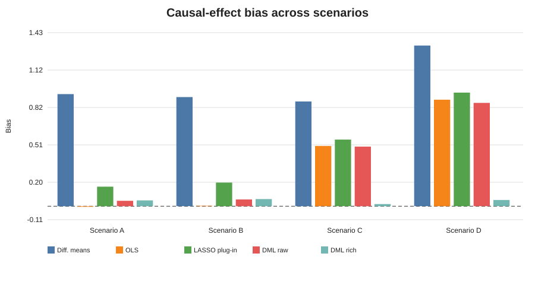
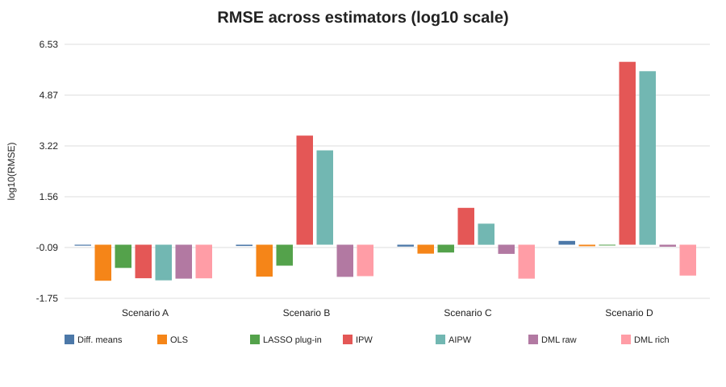
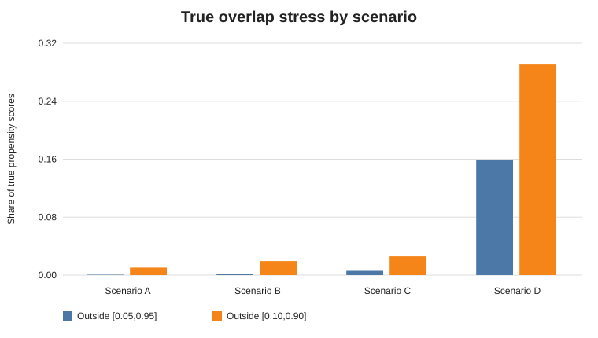

# When Does Double Machine Learning Improve Causal Estimation?

**A Monte Carlo benchmark of dimensionality, nonlinear nuisance structure, regularization, and overlap in simulated health data**

> **Status:** primary experiment complete. The repository contains the frozen 800-dataset Monte Carlo results (200 replications × 4 scenarios), reviewer-facing notebooks, figures, diagnostics, and reproducibility metadata. No real patient data are used.

## Research question

**When does Double Machine Learning improve causal estimation, and when does it fail to do so?**

The project asks how conventional causal estimators and DML behave as observed confounding becomes high-dimensional, nonlinear, and difficult to represent, and as treatment overlap deteriorates.

A second question is deliberately predictive-versus-causal:

> Does better nuisance prediction necessarily imply better causal-effect estimation?

## Main finding

The simulation does **not** show that DML automatically beats classical estimators.

It shows something more specific:

> **DML works well when the nuisance representation is adequate; orthogonalization does not compensate for a badly misspecified nuisance learner, and better treatment prediction does not repair weak overlap.**

The strongest contrast occurs in the nonlinear Scenario C. The true effect is $\theta_0=1$:

| Estimator | Bias | RMSE | 95% coverage |
|---|---:|---:|---:|
| OLS adjustment | 0.498 | 0.511 | 0.040 |
| DML — raw LASSO | 0.492 | 0.501 | 0.000 |
| **DML — rich-dictionary LASSO** | **0.018** | **0.078** | **0.945** |

Under weak overlap (Scenario D), rich-dictionary DML remains much more accurate than the alternatives, but coverage falls to 90.0% and RMSE rises to 0.099. DML therefore does not “solve” positivity.

See [`docs/results.md`](docs/results.md) for the full interpretation.



## Why this project

Machine-learning algorithms optimize prediction. A causal estimand is a different statistical object. Naively inserting regularized or flexible nuisance predictions into a causal procedure can transmit model-selection and overfitting bias into a low-dimensional target.

Double/Debiased Machine Learning addresses this problem through:

1. **Neyman-orthogonal scores**, which reduce first-order sensitivity to nuisance-estimation error; and
2. **cross-fitting**, which evaluates the score using out-of-fold nuisance predictions.

This repository therefore implements the estimating equation directly rather than treating DML as a black-box package call.

## Primary causal model

The data-generating process satisfies the partially linear regression model

$$
Y_i=D_i\theta_0+g_0(X_i)+\varepsilon_i,
\qquad
\mathbb E[\varepsilon_i\mid D_i,X_i]=0.
$$

Treatment is binary, the outcome is continuous, and the true treatment coefficient is

$$
\theta_0=1.
$$

Because treatment effects are constant by construction,

$$
\operatorname{ATE}
=
\mathbb E\!\left[Y_i(1)-Y_i(0)\right]
=1.
$$

The project also retains a manual binary-treatment IRM/AIPW DML implementation as a secondary extension.

## Four simulation scenarios

| Scenario | N | Raw p | Structure | Overlap | Purpose |
|---|---:|---:|---|---|---|
| **A** | 1,000 | 10 | Linear, low-dimensional | Good | Classical benchmark |
| **B** | 1,000 | 400 | Sparse linear, many controls | Good | Stress regularization/dimensionality |
| **C** | 1,000 | 400 | Nonlinear + interactions | Good | Stress nuisance representation |
| **D** | 1,000 | 400 | Same nonlinear structure as C | Weak | Stress positivity/overlap |

Covariates follow a correlated Gaussian AR(1)-type design with $\rho=0.30$.

In scenarios B–D:

- $X_1,\ldots,X_{10}$ are true confounders;
- $X_{11},\ldots,X_{15}$ predict treatment only;
- $X_{16},\ldots,X_{20}$ predict outcome only;
- $X_{21},\ldots,X_{400}$ are noise.

This separation is important because predictive relevance is not identical to confounding relevance.

## A genuinely high-dimensional nuisance dictionary

The primary flexible DML learner is not a model-zoo addition. It creates a fixed nonlinear basis for **every** raw covariate $X_j$:

$$
\phi_j(X)
=
\left(
X_j,
X_j^2-1,
\sin X_j,
\mathbf 1\{X_j>0\}-\frac12
\right),
$$

plus adjacent interactions

$$
X_jX_{j+1}-\rho,
\qquad j=1,\ldots,p-1.
$$

Hence the total dictionary dimension is

$$
p^*=4p+(p-1)=5p-1.
$$

For $p=400$,

$$
p^*=5(400)-1=1999>N=1000.
$$

LASSO therefore performs regularized nuisance learning in a genuinely high-dimensional $p^*>N$ design. The dictionary is deterministic and applied to all covariates; it does not receive an oracle list of active variables.

## Estimator ladder

The primary benchmark contains seven estimators:

1. **Difference in means** — unadjusted confounding benchmark.
2. **OLS adjustment** — classical regression benchmark.
3. **Naive LASSO g-formula plug-in** — regularized outcome prediction without an orthogonal score.
4. **Parametric IPW** — unpenalized logistic propensity weighting.
5. **Parametric AIPW** — doubly robust parametric benchmark.
6. **DML-PLR + raw LASSO** — sparse linear nuisance learning.
7. **DML-PLR + rich-dictionary LASSO** — nonlinear high-dimensional nuisance learning.

Random Forest and XGBoost implementations remain available as optional sensitivities; they are not used in the frozen primary results.

## Manual DML implementation

Let

$$
\ell_0(X)=\mathbb E[Y\mid X],
\qquad
m_0(X)=\mathbb E[D\mid X].
$$

For $W=(Y,D,X)$ and nuisance functions $\eta=(\ell,m)$, the partialling-out score is

$$
\psi(W;\theta,\eta)
=
\bigl\{Y-\ell(X)-\theta[D-m(X)]\bigr\}
\bigl\{D-m(X)\bigr\}.
$$

The DML estimator solves the cross-fitted sample moment condition

$$
\frac{1}{n}
\sum_{i=1}^{n}
\psi\!\left(W_i;\widehat\theta,\widehat\eta_{-k(i)}\right)
=0,
$$

where $\widehat\eta_{-k(i)}$ denotes nuisance functions estimated without using the fold containing observation $i$.

Equivalently, after forming the out-of-fold residuals

$$
\widetilde Y_i=Y_i-\widehat\ell_{-k(i)}(X_i),
\qquad
\widetilde D_i=D_i-\widehat m_{-k(i)}(X_i),
$$

the partialling-out estimator can be written as

$$
\widehat\theta
=
\frac{\sum_{i=1}^{n}\widetilde D_i\widetilde Y_i}
     {\sum_{i=1}^{n}\widetilde D_i^2}.
$$

The code manually:

1. creates five outer folds;
2. fits nuisance models on the complement of each fold;
3. generates held-out $\widehat\ell(X)$ and $\widehat m(X)$;
4. residualizes outcome and treatment;
5. estimates $\theta$ from the orthogonal score; and
6. computes an influence-function standard error.

No DML package is required for the primary estimator.

## Frozen L1 penalties

L1 hyperparameters were calibrated **before the scientific run** using separate seeds 9101–9103 and nuisance-prediction metrics only. Treatment-effect error was not used to select them.

Frozen values:

- outcome LASSO $\alpha=0.05$;
- L1-logistic treatment nuisance $C=0.05$.

The full calibration grid is committed in `results/l1_penalty_calibration.csv`.

## Monte Carlo design

The primary experiment contains

$$
4\times 200=800
$$

simulated datasets.

For an estimator $\widehat\theta_r$ in Monte Carlo replication $r=1,\ldots,R$, the reported bias is

$$
\operatorname{Bias}(\widehat\theta)
=
\frac{1}{R}
\sum_{r=1}^{R}
\left(\widehat\theta_r-\theta_0\right),
$$

and the root mean squared error is

$$
\operatorname{RMSE}(\widehat\theta)
=
\sqrt{
\frac{1}{R}
\sum_{r=1}^{R}
\left(\widehat\theta_r-\theta_0\right)^2
}.
$$

For each estimator the repository records:

- bias and Monte Carlo SE of bias;
- RMSE;
- empirical SD;
- mean estimated SE;
- empirical 95% coverage and its Monte Carlo SE;
- average interval width;
- median and 95th-percentile absolute error;
- estimator failure rate;
- runtime.

Coverage is interpreted jointly with interval width and failures. This matters because unstable IPW/AIPW procedures can obtain superficially high coverage only through enormous intervals.

## Primary results by scenario

### A — classical model is correctly specified

OLS is essentially unbiased (bias -0.005), with RMSE 0.067 and 96.5% coverage. DML is stable but not superior; fixed regularization produces small finite-sample bias and some undercoverage.

**Lesson:** complexity is unnecessary when the simple model is right.

### B — sparse many-control setting

OLS remains excellent because the structural outcome model is linear and $N>p$. Raw DML-LASSO has similar RMSE but more bias and lower coverage.

Unpenalized parametric IPW/AIPW become heavy-tailed and fail numerically in 6.5% of replications.

**Lesson:** “many controls” alone does not imply DML must dominate correctly specified regression, but unregularized propensity modeling can become fragile.

### C — nonlinear confounding

Raw-linear OLS and raw-linear DML both retain approximately +0.50 bias. Rich-dictionary DML reduces bias to +0.018 and restores 94.5% coverage.

Outcome-nuisance RMSE falls from 1.171 for raw DML-LASSO to 0.458 for rich-dictionary DML.

**Lesson:** orthogonalization requires adequate nuisance learning; DML is not a cure for arbitrary nuisance misspecification.

### D — weak overlap

The rich learner's mean propensity AUC rises from 0.646 in C to 0.825 in D, yet causal RMSE worsens from 0.078 to 0.099 and coverage falls from 94.5% to 90.0%.

The share of **true** propensity scores outside $[0.05,0.95]$ rises from roughly 0.6% to 15.9%.

**Lesson:** better treatment classification can indicate worse causal overlap.





## Reproducibility

The final high-dimensional simulations were executed in five independent 40-replication blocks so long-lived native numerical state could not contaminate the run. The batch seeds are recorded in the methodology and run manifest, and the raw outputs are merged deterministically.

The GitHub snapshot includes:

- deterministic DGP and seeds;
- configuration files;
- manual estimator source code;
- unit/smoke tests;
- nuisance-only hyperparameter calibration;
- overlap calibration;
- frozen Monte Carlo summaries plus SHA-256 reference hashes for the raw replication-level outputs;
- Monte Carlo summaries;
- automated figures;
- execution-validated notebooks;
- a staged CI workflow;
- an optional DoubleML validation hook.

Current automated test status: **9 passing**.

> **Repository-size note:** the GitHub portfolio snapshot intentionally omits the multi-megabyte replication-level `*_raw.csv` files and the generated example dataset. They are deterministic derivatives of the committed DGP/configuration and recorded seeds. Their frozen SHA-256 hashes remain in `results/run_manifest.json`, and the committed scripts reproduce them exactly.

## Repository structure

```text
double-ml-health-data-benchmark/
├── README.md
├── pyproject.toml
├── references.bib
├── configs/
├── data/
├── docs/
│   ├── methodology.md
│   ├── results.md
│   ├── literature_matrix.md
│   └── design_decisions.md
├── src/dml_health_benchmark/
│   ├── dgp.py
│   ├── features.py
│   ├── learners.py
│   ├── estimators.py
│   ├── diagnostics.py
│   ├── monte_carlo.py
│   ├── plotting.py
│   └── validation.py
├── scripts/
│   ├── calibrate_lasso_penalties.py
│   ├── calibrate_overlap.py
│   ├── run_experiment.py
│   ├── merge_batch_outputs.py
│   ├── export_example_data.py
│   └── make_figures.py
├── tests/
├── notebooks/
├── results/
│   ├── run_manifest.json
│   ├── key_results.csv
│   ├── combined_summary.csv
│   └── scenario_*_summary.csv
└── figures/
```

## Run the project

Install the primary environment:

```bash
pip install -e .
```

Run a short reproducibility check:

```bash
dml-health-run --scenario C --replications 10 --folds 5 --jobs 1
```

Run one full scenario in an environment that supports a long process:

```bash
dml-health-run --scenario C --replications 200 --folds 5 --jobs 5
```

For isolated blocks, run separate 40-replication jobs and merge them with:

```bash
python scripts/merge_batch_outputs.py \
  --scenario C \
  --batch-root results/batches_C \
  --output-dir results
```

Generate figures from the saved raw outputs:

```bash
python scripts/make_figures.py \
  results/scenario_A_raw.csv \
  results/scenario_B_raw.csv \
  results/scenario_C_raw.csv \
  results/scenario_D_raw.csv
```

## Reviewer notebooks

1. `01_theory_and_dgp.ipynb` — causal target, assumptions, DGP and overlap.
2. `02_manual_dml_walkthrough.ipynb` — cross-fitting and orthogonal-score derivation from scratch.
3. `03_monte_carlo_analysis.ipynb` — reads the frozen results and reproduces the substantive diagnostics.

## Boundaries and limitations

- This is a simulation study, not a clinical-effect analysis.
- Treatment effects are constant by construction.
- The rich basis intentionally contains transformation families capable of representing the nonlinear DGP; it is a controlled learner-adequacy experiment.
- Fixed nuisance penalties are one finite-sample design choice.
- The unpenalized parametric propensity benchmark is deliberately stressed in the 400-control settings.
- Sample-size/fold-count and tree-learner sensitivities remain extensions.
- `DoubleML` package agreement is not yet claimed because the optional package was unavailable in the execution environment.

## Methodological foundation

The project is anchored to the high-dimensional treatment-effect, doubly robust, DML/orthogonality, cross-fitting, and overlap literature. See [`docs/literature_matrix.md`](docs/literature_matrix.md) and [`references.bib`](references.bib).
